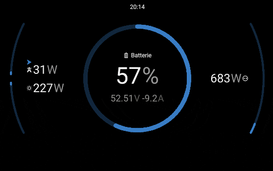
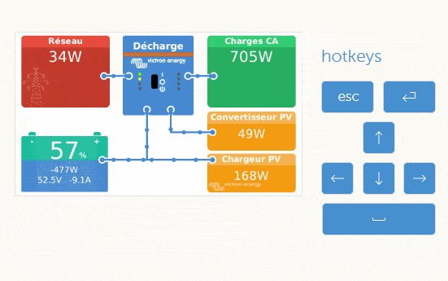
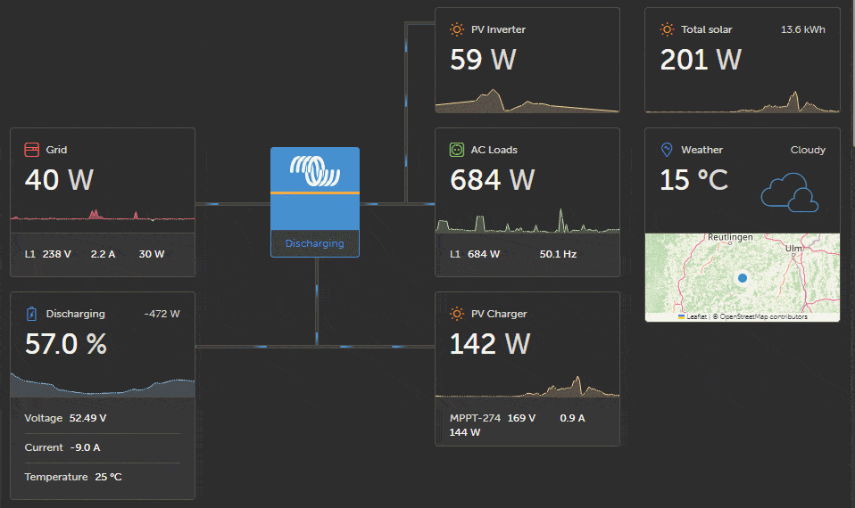
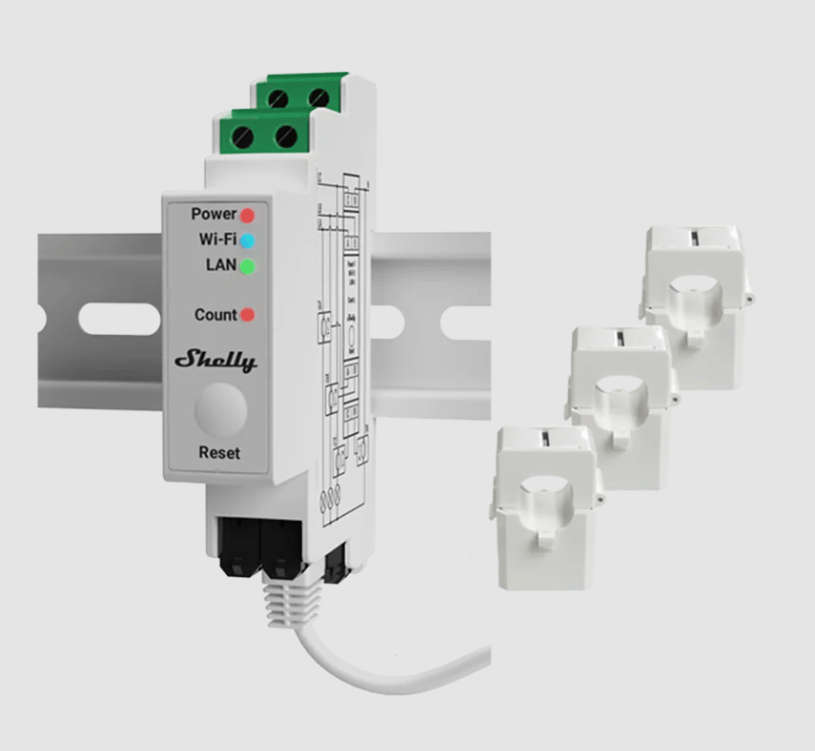
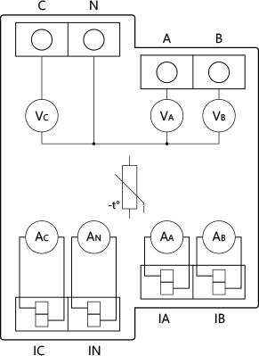

#  Shelly PRO 3EM > Victron Energy Venus OS 
**Integrate Shelly PRO 3EM as a device to Victron Energy Venus OS (dbus-shelly-pro-3em-pvinverter)**

Venus OS is the operating system developed by Victron Energy that runs on devices such as the Cerbo GX, Color Control GX, Venus GX, and other GX-class hardware. It acts as the central control platform for Victron energy systems, allowing real-time monitoring, configuration, and data logging via VRM (Victron Remote Management).

Shelly Pro 3EM is a professional-grade three-phase energy meter with Wi-Fi and LAN connectivity. It supports independent monitoring of three AC channels and provides high-resolution energy and power measurements through its REST API. It's well suited for residential, commercial, or industrial applications and is particularly useful when needing multiple power measurements from a single device.

This project integrates Shelly Pro 3EM measurements into the Victron Venus OS ecosystem via D-Bus, enabling flexible use of each energy channel (e.g., grid, PV inverter, or generator input) in a Victron-based installation.

## Purpose

This module offers the advantage of fine-grained configuration of your energy sources.
The Shelly Pro 3EM supports three independent power measurements, making it a cost-effective solution — especially for single-phase photovoltaic systems.
For example:
* Channel A can be used to measure the grid,
* Channel B for PV inverter production,
* and Channel C to monitor the output of a MultiPlus inverter/charger.

With this module, you can easily define in the configuration file which channel is used for your PV Inverter source.

## Prerequisites
To use this module, you will need:

- A Shelly Pro 3EM smart meter installed and connected to your network
- The IP address or hostname of the Shelly Pro 3EM device (e.g. 192.168.1.120 or shellypro3em.local). It is strongly recommended to assign a static IP to your Shelly device (via DHCP reservation or static config) to ensure consistent communication
- A system running Venus OS (e.g. a GX device such as Cerbo GX, Venus GX, or Raspberry Pi with Venus OS)

⚠️ Important:
Pro 3EM data will only be read by this module if the parameter `Settings → Device Profile` is set to **Triphase**. This module is incompatible with the "Monophase + Active Energy" profile.


## How it works

### Details / Process
This module is inspired by @fabian-lauer dbus-shelly-3em-smartmeter implementation.
So what is the script doing:
- Running as a service
- connecting to DBus of the Venus OS `com.victronenergy.pvinverter.http_{DeviceInstanceID_from_config}`
- After successful DBus connection Gen2+ Shelly PRO 3EM is accessed via REST-API (RPC) - simply the status and Data are called and JSON are returned with all details
- Firmware version displayed as device Hardware Version
- Serial/MAC is taken as device serial
- Every 1000ms Shelly PRO 3EM data are read and updates the values on the DBus device


### Pictures 








## Install & Configuration
### Get the code
Just copy the source into a folder under `/data/` , in sub-directory `/data/dbus-shelly-3em-pro-smartmeter`. Give a look to the parameters like Shelly module ip address, after that call the start ./install.sh script.

Here steps in detail to follow
- Connect your GX DevusOS with a console terminal (like Putty). You have before Set access level to Superuser (https://www.victronenergy.com/live/ccgx:root_access)
- Copy paste this lines (line by line) on you console
  
```
wget -O /data/master.zip https://github.com/f5uii/dbus-shelly-pro-3em-smartmeter/archive/refs/heads/master.zip
unzip -o /data/master.zip -d /data
rm /data/master.zip

# Rename extracted folder to target directory
mv /data/dbus-shelly-pro-3em-smartmeter-master /data/dbus-shelly-pro-3em-smartmeter

chmod +x /data/dbus-shelly-pro-3em-smartmeter/install.sh
cd /data/dbus-shelly-pro-3em-smartmeter

# Edit the parameters in the config file (see below and in the file comments)
nano config.ini
# Save and exist by CTRL + X

./install.sh
```

### Configuration by config.ini
Within the project there is a file `config.ini` - just change the values - most important is the deviceinstance, custom name and phase under "DEFAULT" and host, username and password in section "ONPREMISE". More details below:

| Section             | Key                | Description                                                                 | Possible Values                    | Default     |
|---------------------|--------------------|-----------------------------------------------------------------------------|------------------------------------|-------------|
| `[DEFAULT]`         | `Log_Level`        | Logging verbosity level                                                    | `INFO`, `DEBUG`, `WARNING`, `ERROR`, `CRITICAL`| `ERROR`      |
|                     | `Deviceinstance`   | Unique D-Bus instance ID                                                   | integer (e.g., `41`)               | *required*  |
|                     | `CustomName`       | Custom name shown in GX                                                    | free text                          | `Shelly-Pro3EM` |
| `[SHELLY_CONNECTION]` | `Host`           | IP address or hostname of the Shelly Pro 3EM                               | e.g., `192.168.1.100`              | *required*  |
|                     | `Username`         | HTTP username (if Shelly is password-protected)                            | free text                          | *(empty)*   |
|                     | `Password`         | HTTP password                                                              | free text                          | *(empty)*   |
| `[PVINVERTER]`       | `Phase`           | Which phase to read (for single-phase usage)                               | `A`, `B`, `C`, `OFF`               | `B`         |
|                     | `InvertPowerSign`  | Whether to invert power sign (useful if wiring direction causes reversal)  | `0` (no), `1` (yes)                | `0`         |
|                     | `PhaseDestination` | Which phase to map this data to                                            | `L1`, `L2`, `L3`                   | `L1`        |
|                     | `EnergyType`       | Energy type to report                                                      | `direct`, `return`                | `direct`    |
|                     | `ACPosition`       | AC position for this source                                                | `0`, `1`, `2`                      |`1`          |

⚠️ In DEBUG mode, logs can quickly grow to significant sizes and may reach limits, potentially causing system instability. Use only when absolutely necessary.

After modifying config.ini, make sure to restart the service using ./restart.sh.

## ⚠️ DISCLAIMER ⚠️
This project is an independent development and is not affiliated with, endorsed by, or supported by Victron Energy B.V., Shelly, or any other brands or manufacturers mentioned herein.

All product names, trademarks, and logos (including but not limited to Victron, VE.Bus, GX, MultiPlus, and Shelly) are the property of their respective owners. They are referenced in this repository solely for interoperability and informational purposes.

This code is provided "as is", without warranty of any kind, either expressed or implied, including, but not limited to, the implied warranties of merchantability and fitness for a particular purpose. The entire risk as to the quality and performance of the code lies with the user. Should the code prove defective, you assume the cost of all necessary servicing, repair, or correction.

In no event shall the author be liable for any damages whatsoever, including without limitation:
loss of business profits, business interruption, loss of business information, or any other pecuniary loss arising from the use of or inability to use this software — even if the author has been advised of the possibility of such damages.

By using this project, you acknowledge that it is your responsibility to ensure its compatibility with your system and to comply with all terms, licenses, and safety requirements of the original hardware manufacturers.


## Used documentation
- https://github.com/victronenergy/venus/wiki/dbus#pv-inverters   DBus paths for Victron namespace
- https://github.com/victronenergy/venus/wiki/dbus-api   DBus API from Victron
- https://www.victronenergy.com/live/ccgx:root_access   How to get root access on GX device/Venus OS
- https://shelly-api-docs.shelly.cloud/gen2/ComponentsAndServices/EM Shelly Gen2+ Device API EM documentation
- https://shelly-api-docs.shelly.cloud/gen2/ComponentsAndServices/EMData Shelly Gen2+ Device API EMData documentation

## Tip for developpers

VSCode IDE is very usefull for editing remotely your python code with Plugin VSCode remote SSH on the VenusOS (BusyBox Linux OS). Install on your computer the remote ssh under VSCode. 
Run these few lines on an ssh session of your VenuOS :


```opkg update
opkg upgrade
opkg install procps
opkg install libatomic
```

As a bonus, in ``VictronEnergy_ProductID.txt`` you will find a list of ProductIDs and their corresponding labels that you can use in your future developments under the ProductId field of the VeBus.


[](https://www.buymeacoffee.com/f5uii)
